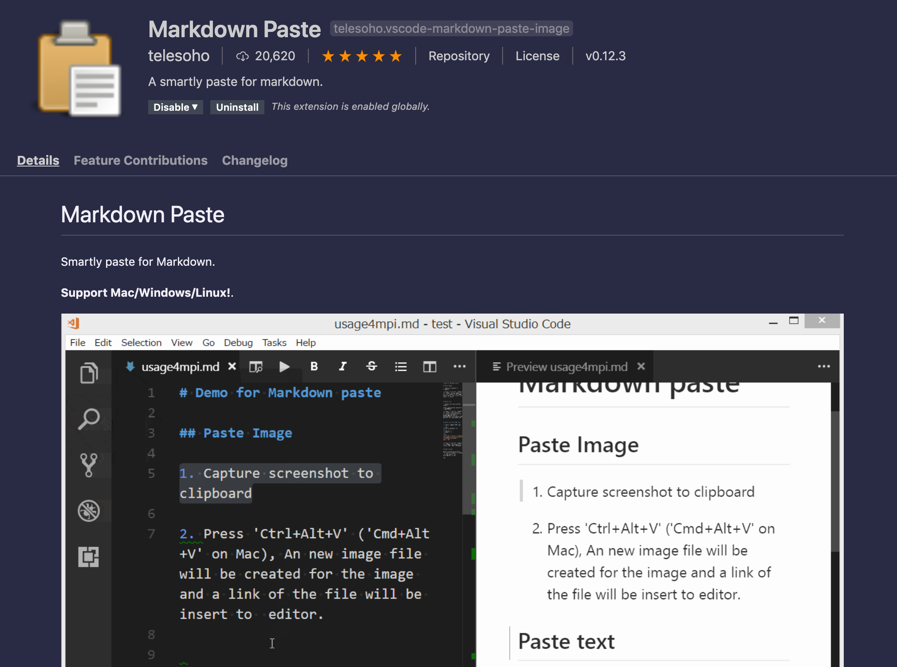

---
# Using the folder/index structure so that images can be included
# Check out the Markdown Paste VSCode extension to paste images
title: This is an essay template
author: Julius Tarng
---

Things that should be an exerpt are here above the first ---. Totally optional! Essays are longer form, more higher quality content.

---

## Try not to use H1 # in markdown
Since there should only be one per page per WCAG, which should usually be the site logo. Paste images with the Markdown Paste VSCode extension (Cmd Shift X, search "Markdown Paste"), and Cmd Alt V to paste and save the image in this folder. Make sure to include \[alt text\]!

We can add embed style plugins like [https://www.npmjs.com/package/eleventy-plugin-youtube-embed](youtube-embed) which will let us paste links to things and have Eleventy handle converting that to a rich embed.

Hooray!